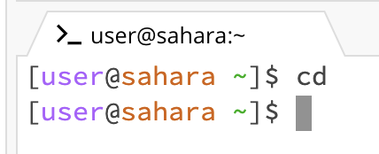
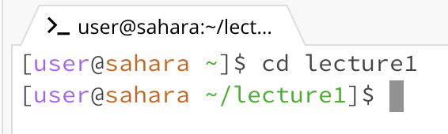
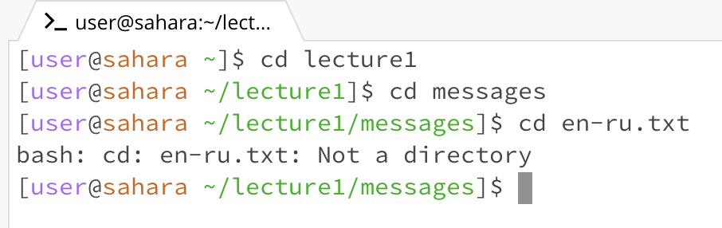
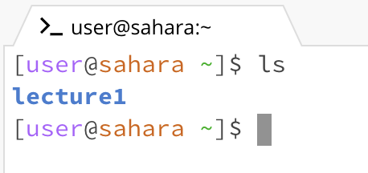

# Screenshot 1 - 3 : (cd commmand) Change Directory 

* There is no working directory being ran
* The output is empty because I didn't specify where to change the directory to
* Not an error

* The working directory is lecture 1
* The output demonstrates that I am now inside the lecture 1 directory; able to access its content
* Not an error

* The working directory is the messages that is inside of the lecture 1 folder
* The first output shows entering the messages directory to then not being able to access the english to russian
  translation file
* I suppose this would be an error in the sense that you cannot change your directory to a file, so a mismatch.

# Screenshot 4 - 6 : (ls commmand) listing

* Considering we are only listing what is in each directory, the working directory would be the current of which we are listing; so lecture 1
* 
