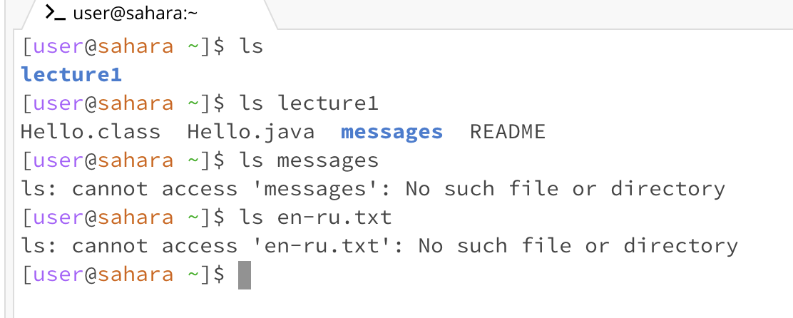
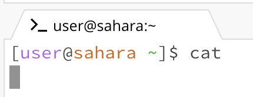
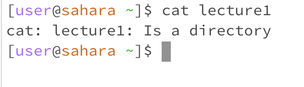

# Screenshot 1 - 3 : (cd commmand) Change Directory 

* ## There is no working directory being ran
* ## The output is empty because I didn't specify where to change the directory to
* ## Not an error

* ## The working directory is lecture 1
* ## The output demonstrates that it is now inside the lecture 1 directory; able to access its content
* ## Not an error

* ## The working directory is the messages that is inside of the lecture 1 folder
* ## The first output shows entering the messages directory to then not being able to access the english to russian translation file
* ## I suppose this would be an error in the sense that you cannot change your directory to a file, so a mismatch.

--- 

# Screenshot 4 - 6 : (ls commmand) listing

* ## Considering we are only listing what is in each directory, the working directory would be the current of which we are listing; so technically no working directory is being ran
* ## The output lists the main directory becuase without specifing a location or path, it will simply just list the first document or directory
* ## Not an error

* ## The working directory is lecture 1
* ## the output demonstrates the listing of lecture 1's content that is accessible
* ## Not an error

* ## No current directory as it finds none; errors
* ## TODO
* ## TODO

---

# Screenshot 7 - 9 : (cat commmand) Concatenation

* ## There is no current directory being ran
* ## The output exhibits a need of user input to print the contents of a file or just text
* ## Not an error

* ## There technically is no current directory being ran as cat is just a printer for files and texts, not a directory navigator
* ## The ouput demonstates the use of cat as it specifies what each document is specifically.
* ## Not an error

* ## No working directory
* ## TODO
* ## TODO
